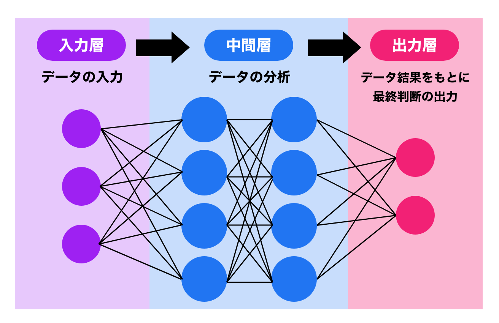
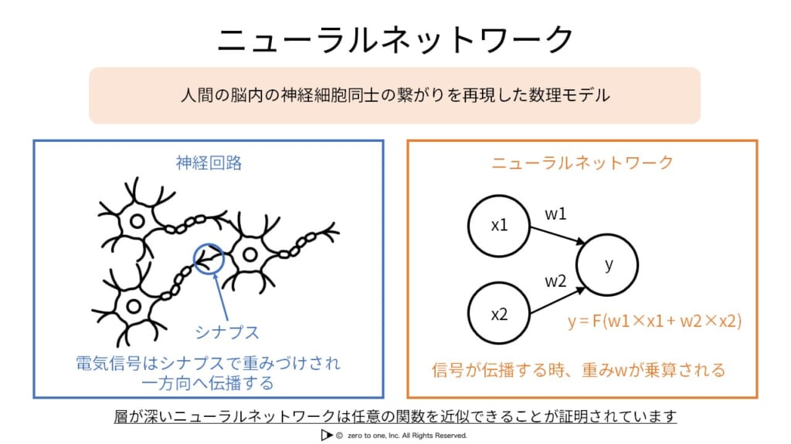

# AIとはなにか
**AIは一言で言うと、人間のやるような動作や振る舞いをコンピューターで再現するシステムです。**  
なので、ただ天気の情報をサイトから取得してきて値表示させる、それはAIではありません。  
しかし、値を取得して湿度などの相関関係などを出力したりする、それがAIです。

AIはいくつかの要素で、どこまで信憑性があるかや予測を行います。

# 線形回帰　非線形回帰とは
その時のデータが本当に相関関係があるのかなどを確認しないと、誤った学習をさせてしまいます。  
データ内にハズレ値やノイズがある場合、その時に分析をするものがあります。  
それが**線形回帰**と**非線形回帰**です（他にもあります）。

**線形回帰とは**  
  
データの中にある関係値を直線します。

**非線形回帰とは**  
  
データの中にある関係を曲線にし表します。

## 線形回帰とは
線形回帰とは、直線的な関係の数値のときに使います。  
比較的直線の関係になるようなものに使われます。  
例: **日照時間と植物の発育**など。

目的変数と説明変数がどれだけ影響を与えるかを予測するものです。

## 非線形回帰
非線形回帰は、直線では説明できない曲がったデータのときに使います。

### どう使い分けるか
**非線形曲線**  
- 塩の溶解度  
- バッテリー残量と電圧  

**線形曲線**  
- 睡眠時間と集中力テストの点数（6〜8時間）  
- 勉強時間とテストの点数  

## どのような数式で表すのか見ていきましょう
**線形回帰**  
```
y = ax + b
```
 
- y は目的変数（予測したい数字）  
- x は説明変数（入力した値）  
- a は傾き（変化の割合）  
- b は切片（直線がy軸と交わる点）
です

**非線形回帰では複数のモデルが存在します。代表的なもの**  
- 指数関数モデル: `y = a × e^(bx)`  
- 多項式モデル: `y = ax² + bx + c`  
- ロジスティックモデル: `y = L / (1 + e^(-k(x - x₀)))`  

ここで、a, b, c, k, L, x₀ は値です.

# シグモイド関数やニューラルネットワークについて
シグモイド関数は、**非線形回帰の一つのもの**で、ニューラルネットワークでよくでてくる考え方です
シグモイド関数は、どんな数を入れても必ず0から1の間の数に変換するものです
例として、テストの点数が100点満点だった時に、それを0から1の範囲（パーセンテージ）に変換するのに似ています。
つまりどのくらい〇〇であるかなどが判定できます

### シグモイド関数の数式

`σ(x) = 1 / (1 + e^(-x))`
この関数の特徴：
- **値が小さい時**: 出力は0に近づく
- **値が0**: 出力は0.5
- **値が大きい時**: 出力は1に近づく
## ニューラルネットワークとは？
ニューラルネットワークは、人間の脳の仕組みを真似して作られたコンピュータの仕組み。  
人間の脳にある細胞が、情報を伝える様子を真似して作られました。


### 働く流れ
1. **情報を受け取る**: 複数の情報（数字）が入ってくる
2. **情報を合計する**: 受け取った情報を全部足し算する
3. **判断する**: シグモイド関数を使って「YES」か「NO」かを決める
4. **結果を伝える**: 次の神経細胞に結果を送る


